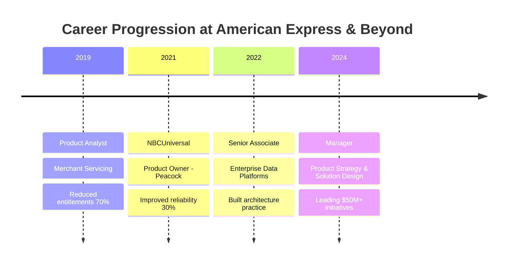

  

  

  
  
  

 

  
  
  

 

  <table>
    <tr>
      <td>
        
      </td>
    </tr>
  </table>

---

<h2 align="center">
   About Me
</h2>

  

     Currently pursuing my <strong>M.S. in Computer Science at Georgia Tech</strong> while leading enterprise data platforms at <strong>American Express</strong>
  

  

     My work sits at the intersection of <strong>technical innovation</strong> and <strong>business strategy</strong>
  

  

     Passionate about building systems that <strong>scale elegantly</strong> and <strong>serve purposefully</strong>
  

  

     Whether it's architecting platforms for <strong>2000+ users</strong> or designing <strong>ethical AI solutions</strong>, I believe in creating technology that matters
  

 

---

<h2 align="center">
   Current Focus Areas
</h2>

  <table>
    <tr>
      <td width="50%" valign="top">
        

          
          <h3>🤖 AI & Machine Learning</h3>
          
Exploring <strong>autonomous agents</strong> and <strong>ethical AI</strong> at Georgia Tech. Research focus on responsible AI deployment and human-AI collaboration.

        

      </td>
      <td width="50%" valign="top">
        

          
          <h3>🏗️ Enterprise Platforms</h3>
          
Modernizing systems serving <strong>2000+ users</strong> and <strong>300+ applications</strong>. Leading infrastructure transformation initiatives.

        

      </td>
    </tr>
    <tr>
      <td width="50%" valign="top">
        

          
          <h3>☁️ Hybrid Cloud Solutions</h3>
          
Building solutions that <strong>reduce deployment time by 40%</strong>. Certified Google Cloud Professional Architect.

        

      </td>
      <td width="50%" valign="top">
        

          
          <h3>👥 Strategic Leadership</h3>
          
Managing <strong>$50M+ operational initiatives</strong>. Bridging technical excellence with business outcomes.

        

      </td>
    </tr>
  </table>

---

<h2 align="center">
   Technical Arsenal
</h2>

  <h3>☁️ Cloud & Infrastructure</h3>
  

    
    
    
    
  

  
  <h3>💻 Development</h3>
  

    
    
    
    
  

  
  <h3>🧠 AI & Data</h3>
  

    
    
    
    
  

  
  <h3>📊 Leadership & Process</h3>
  

    
    
    
    
  

---

<h2 align="center">
   Featured Projects
</h2>

  <table>
    <tr>
      <td width="50%">
        

          <h3>💰 antfinance.app</h3>
          
          
            
          
          
Building the future of personal finance through <strong>community intelligence</strong>. A privacy-first platform that revolutionizes how people manage their money.

        

      </td>
      <td width="50%">
        

          <h3>📊 Cashflow Dispersion Model</h3>
          
          
            
          
          
Applied <strong>Economic Order Quantity theory</strong> to personal finance, creating an innovative model for optimizing liquid asset management.

        

      </td>
    </tr>
  </table>

---

<h2 align="center">
   Professional Journey
</h2>

  

<b>📋 Detailed Experience</b>

### 🏢 American Express • Manager - Product Strategy & Solution Design
*Enterprise Data Platforms & Governance (2024-Present)*
- 🎯 Leading infrastructure modernization for **2000+ technical users**
- 💰 Managing **$50M+ in operational expenses**
- ⚡ Reduced deployment time by **40%** through architectural improvements
- 🛡️ Built governance framework supporting **300+ applications**

### 🏢 American Express • Senior Associate
*Enterprise Data Platforms & Governance (2022-2024)*
- 🏗️ Built technical architecture practice for hybrid computing platforms
- 📊 Delivered **10 reference architectures** for enterprise use
- 🎤 Presented **25+ technical deep-dives** to senior leadership
- 🔄 Translated complex infrastructure into business value propositions

### 📺 NBCUniversal Media • Product Owner
*Peacock Streaming Platform (2021)*
- 📡 Designed enterprise content delivery platform
- 👥 Led **3 development teams** in infrastructure modernization
- 🔒 Implemented SOX-compliant security controls
- 📈 Improved system reliability by **30%**

---

<h2 align="center">
   Education & Certifications
</h2>

  <table>
    <tr>
      <td align="center" width="50%">
        
        <h3>Georgia Institute of Technology</h3>
        
<strong>M.S. Computer Science</strong> 
        🤖 AI Specialization 
        📅 Expected 2025 
        🔬 Research: Autonomous Agents & Ethics

      </td>
      <td align="center" width="50%">
        
        <h3>Arizona State University</h3>
        
<strong>B.S.E. Engineering Management</strong> 
        📊 Statistics Minor 
        🎓 Cum Laude 
        📈 GPA: 3.52/4.0

      </td>
    </tr>
  </table>
  
  <h3>🏆 Professional Certifications</h3>
  

    
    
    
  

---

<h2 align="center">
   GitHub Analytics
</h2>

  
  

  

  

---

<h2 align="center">
   Let's Connect!
</h2>

  

    <em>"I believe in building technology that scales elegantly and serves purposefully."</em>
  

  
  
I'm always open to discussing:

  

    🤖 <strong>AI/ML Projects</strong> | ☁️ <strong>Cloud Architecture</strong> | 🚀 <strong>Innovation Opportunities</strong> | 💡 <strong>Technical Leadership</strong>
  

  
  

    
    
  

  

  

<!-- Hidden analytics -->

