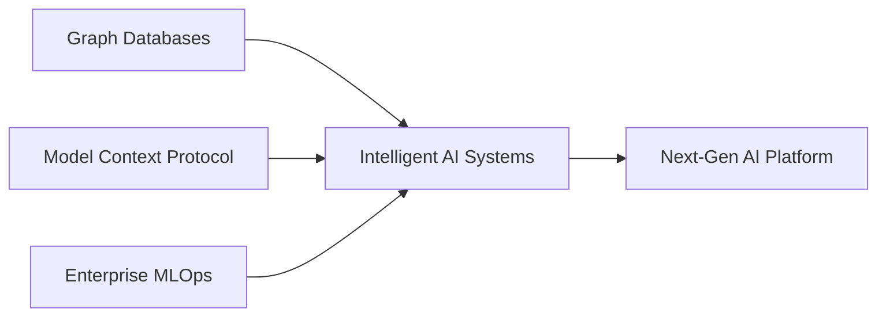

<div align="center">
  
</div>

<div align="center">
  
  [](https://www.linkedin.com/in/anthony-trevinoo)
  [](mailto:trevino293@gmail.com)
  [](https://www.antfinance.app)
  
  <br/>
  
  
  
  
  
  
</div>

---

###  &nbsp;About Me

```python
class AnthonyTrevino:
    def __init__(self):
        self.role = "Manager - Product Strategy & Solution Design"
        self.company = "American Express | Enterprise Data & AI"
        self.location = "Phoenix, AZ 🌵"
        self.education = {
            "masters": "Georgia Tech - M.S. Computer Science (AI)",
            "bachelors": "Arizona State - B.S.E. Engineering Management"
        }
        self.current_focus = ["Graph-based AI Context", "MCP Implementation", "MLOps at Scale"]
        self.fun_fact = "Building AI that understands money better than humans 💰"
    
    def currently_working_on(self):
        return {
            "🔬": "Model Context Protocol with Neo4j for intelligent agent memory",
            "🏗️": "Enterprise ML platform serving 2,000+ technologists",
            "💡": "antfinance.app - Community-driven financial intelligence",
            "📊": "$50M+ infrastructure modernization initiative"
        }
```

---

### 🚀 Current Mission

> **Architecting the intersection of Graph Databases, LLMs, and Enterprise Scale**

Leading AI transformation at **American Express** while pushing boundaries with cutting-edge tech:
- 🧠 **Graph-Enhanced LLMs**: Pioneering MCP + Neo4j for contextual AI memory systems
- ⚡ **40% faster deployments** through intelligent platform architecture
- 🔒 **20PB+ privacy-preserving** data infrastructure
- 🎯 **300+ AI applications** under governance

---

### 🛠️ Tech Arsenal

<div align="center">

#### Core Stack


#### AI/ML Ecosystem


#### Cloud & Infrastructure


</div>

---

### 🔥 Featured Projects

<table>
  <tr>
    <td width="50%">
      <h3>🧠 Graph-Based AI Context System</h3>
      <p><strong>Tech:</strong> Model Context Protocol • Neo4j • Vector Embeddings</p>
      <p>Revolutionary approach to LLM memory using graph databases for persistent, queryable context. Achieving 3x improvement in response relevance.</p>
      <a href="#"></a>
    </td>
    <td width="50%">
      <h3>💰 antfinance.app</h3>
      <p><strong>Tech:</strong> GCP • TensorFlow • Real-time ML</p>
      <p>AI-powered finance platform processing 100K+ daily transactions with community intelligence features.</p>
      <a href="https://www.antfinance.app"></a>
    </td>
  </tr>
  <tr>
    <td width="50%">
      <h3>📊 Cashflow Dispersion Model</h3>
      <p><strong>Tech:</strong> Python • Statistical Modeling • EOQ Theory</p>
      <p>Novel application of operations research to personal finance optimization.</p>
      <a href="https://github.com/trevino293/CFD/blob/main/CFD.pdf"></a>
    </td>
    <td width="50%">
      <h3>🏢 Enterprise AI Governance</h3>
      <p><strong>Impact:</strong> 2,000+ users • 300+ applications</p>
      <p>Comprehensive framework for responsible AI deployment at Fortune 500 scale.</p>
      <a href="#"></a>
    </td>
  </tr>
</table>

---

### 📈 GitHub Analytics

<div align="center">
  
  
</div>

<div align="center">
  <br/>
  
</div>

---

### 🎯 2025 Focus Areas



- 🔮 **Exploring**: Agentic AI workflows with persistent memory
- 🏗️ **Building**: Scalable graph-based knowledge systems
- 📚 **Learning**: Advanced RLHF techniques
- 🤝 **Sharing**: Open-source MLOps tools

---

### 🏆 Credentials & Achievements

<div align="center">

[](https://cloud.google.com/certification)
[](https://www.scaledagile.com/)
[](https://www.iassc.org/)

</div>

**Impact Metrics:**
- 💵 Managing $50M+ operational budget
- 👥 2,000+ platform users
- ⚡ 40% deployment time reduction
- 🔐 20PB+ compliant data infrastructure
- 📱 300+ applications governed

---

### 📫 Let's Connect!

<div align="center">

I'm always interested in discussing:
- 🤖 Graph-enhanced AI architectures
- 🚀 Enterprise ML platform challenges
- 💡 Novel applications of AI in finance
- 🌟 Open source MLOps initiatives

<br/>

**Find me at:** [LinkedIn](https://www.linkedin.com/in/anthony-trevinoo) • [Email](mailto:trevino293@gmail.com) • [antfinance.app](https://www.antfinance.app)

</div>

---

<div align="center">
  
  
  <br/><br/>
  
  <i>⚡ "Code with purpose, scale with elegance, lead with vision"</i>
  
  <br/>
  
  
</div>
